# Contributing to AresRPG

If you want to contribute come on [Discord](https://discord.gg/gaqrFT5) to chat with us beforehand

## Workflow

We use the [GitHub Flow](https://guides.github.com/introduction/flow/) to handle contributions

Branch are usually merged with a fast-forward merge (sometimes with a rebase beforehand if no conflict happens)

## Code Style

This codebase try to follow the [Declarative Programming](https://en.wikipedia.org/wiki/Declarative_programming) Paradigm,
if you don't know this paradigm you can still contribute. Try to learn it while developing your contribution it's not required
to be perfect. We will help you during the review to make it perfect :)

# Architecture

## State Management Pattern

The Code Base follows a State Management Pattern (like [Redux](https://redux.js.org/introduction/core-concepts) or [Vuex](https://vuex.vuejs.org/#what-is-a-state-management-pattern)), this can also be viewed as a [CQRS](https://en.wikipedia.org/wiki/Command%E2%80%93query_separation#Command_query_responsibility_segregation) System

The code is separated into 3 parts:

- State: The source of truth about a client
- Actions: Something that happen that could change the state
- View: The mapping of the state to the client, and what triggers actions

Theses part communicates with a "one-way data flow"



### State

Each minecraft client have it's own state, this state is updated using a function called a reducer.

A reducer is just a function that takes the state and an action as argument and return the next state of the client

```js
function reduce_position(state, { type, payload }) {
  if (type === 'packet/position_look') {
    return {
      ...state,
      position: payload,
    }
  }
  return state
}
```

Theses reducers are called from the `reduce_state` function inside `src/index.js`

### Actions

Actions are JavaScript objects in the form `{ type: String, payload: any }` that describes what happened

Each received packet triggers automatically an action of type `packet/${name}` with the packet content
as `payload`

```js
{
  type: 'packet/position_look',
  payload: {
    x: 0,
    y: 0,
    z: 0,
    yaw: 0,
    pitch: 0,
    onGround: false,
  },
}
```

Each actions can be transformed using functions called `transform` functions. A transform function is a function that take
an action and return a new action

Transform functions are called from the `transform_action` function inside `src/index.js`

### View

The view is implemented using functions called observers.

An observer is a function that takes a `context` object as parameter, this object contains a `client` ([Client](https://github.com/PrismarineJS/node-minecraft-protocol/blob/master/docs/API.md#mcclientisserverversioncustompackets)), an `events` ([EventEmitter](https://nodejs.org/api/events.html#events_class_eventemitter)) a `dispatch` function (`dispatch(type, payload)`) and a `world` object

The `client` is the connection with the minecraft client, you can send and receive packets with it

The `events` is an event channel, a `state` event is emitted when the [State](#State) change, you can use it for custom events

The `dispatch` function is used to create [Actions](#Actions)

The `world` is an immutable object see [World](#World)

```js
function observe_state({ client, events, ... }) {
	events.on('state', state => {
		...
	})
}
```

Observers are called from the `observe_client` function inside `src/index.js`

## World

The World is an immutable object that holds the resources of a world, Merchants, Entity IDs, ...

The World also contain an [EventEmitter](https://nodejs.org/api/events.html#events_class_eventemitter) instance
that can be used to send messages between clients

For example instead of accessing to all the clients, send an events on the world with one client and
listen to it on all the others

You can add data to the world using a function called a `register` function.

A register function take the world as argument and return a new world

## Distributed Server

To be able to handle a lot of players we need to be able to scale the server, in our case we want to be able to do horizontal scaling (Add more instances instead of increasing the size of the instance)

But since testing multiple instances is hard we need to make this transparent, we should not think about making our code distributed when we write it, we should instead think about it once and design our codebase to make it easy

To distribute the server we are lucky our World is immutable, and with the State Management Pattern we only have a one way data flow and all the interactions in our system are known

To distribute the server we have multiple choices see [Game Server Architecture Pattern](https://gameserverarchitecture.com/game-server-architecture-patterns/) for details:

- Distributed Network Connections: multiple servers and the clients are load balanced between all the servers
- Seamless World Game Server: Each server handle a part of the map
- Responsibility-Oriented Game Server: The server is split in different servers that handle different operations, like Microservices

### Distributed Network Connections

We are already handling all clients individually, so we only need to synchronize between servers the `events` in the [World](#World) and Chunks events

### Seamless World Game Server

We need to be able to send a player between servers, we only have one [State](#State) so we only need to send it to the new server
We also need to synchronize `events` in the [World](#World) and Chunks events for the chunk boundaries

### Responsibility-Oriented Game Server

We need to synchronize [Actions](#Actions) between servers and run only a subset of each observers + reducers on each server
We also need to synchronize `events` in the [World](#World) and Chunks events

So to resume the goal here is to write our server like if it was a [Monolithic Architecture](https://gameserverarchitecture.com/2015/10/pattern-monolithic-architecture/) but be able to implement other patterns easily
