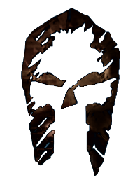

<h1 align=center>AresRPG</h1>
<p align=center>
  
</p>
<p align=center>
  <a href="https://hydre.io">
    
  </a>
  
  
  
  <a href="CONTRIBUTING.md">
    
  </a>
  <a href="https://choosealicense.com/licenses/mit/">
    
  </a>
  <a href="https://discord.gg/gaqrFT5">
    
  </a>
</p>
<h3 align=center>AresRPG is a non-modded MMORPG Minecraft Server for minecraft 1.16</h3>

- [A _bit_ of history](#a-bit-of-history)
  - [The `v1`](#the-v1)
  - [The `v2`](#the-v2)
- [Requirements](#requirements)
  - [Install](#install)
  - [Usage](#usage)
    - [Enable data persistence](#enable-data-persistence)
  - [Contributing](#contributing)
  - [Roadmap](#roadmap)
  - [License](#license)

# A _bit_ of history

AresRPG first came up to the world in 2013 under the name EclozionMMORPG
from the idea of [@StoneBloodTV](https://github.com/jdathueyt) and [@Sceat](https://github.com/Sceat), later on the team splitted due to
an internal lack of organization and **AresRPG** as you know it flew on its own.

Fully written in Java by [@DarkPingoo](https://github.com/DarkPingoo) and [@Sceat](https://github.com/Sceat), the project released a test version
called [the tutorial](https://www.youtube.com/watch?v=29AIkBtScgQ), quite successful and enjoyed by the community it
kept going, the team grew bigger with [@DeltaEvo](https://github.com/DeltaEvo), [@unixfox](https://github.com/unixfox) and many more that you
can still find in the community these days.

## The `v1`

The [gameplay was quite simple](https://www.youtube.com/watch?v=g4xb67Z5dxY), find mobs and kill them, buy the stuff rince and repeat.

4 classes were available:

- Barbarian
- Archer
- Vampire
- Mage

There was duels, exchanges, spells, skill points, teleportation stone, boss fights
team loot, etc..

The world was working though a floor system,
when you complete a floor you go to the next one.
This version made AresRPG [quite famous](https://www.youtube.com/watch?v=dEELCqYUyEI)

## The `v2`

The V2 is [an unreleased version](https://www.youtube.com/watch?v=LkzGcEcBP1Q) of AresRPG,
the goal of this version was to have a procedural open-world instead
of a floor system and more classes than the v1, with an overall gameplay upgrade.

# Requirements

- NodeJS >= 16
- npm

## Install

```bash
$ git clone https://github.com/aresrpg/aresrpg
$ cd aresrpg
$ git submodule update --init
$ npm install
```

## Usage

```bash
$ npm start

# Start with packet logging
$ DEBUG="minecraft-protocol*" npm start
```

### Enable data persistence

Aresrpg is using redis with the rejson module to persist player's state

```bash
$ docker-compose up
$ USE_PERSISTENT_STORAGE="true" npm start
```

## Contributing

See [CONTRIBUTING.md](CONTRIBUTING.md)

## Roadmap

- Reimplement AresRPG v1:
  - TODO
- Develop AresRPG v2:
  - TODO

## License

[MIT](https://choosealicense.com/licenses/mit/)
