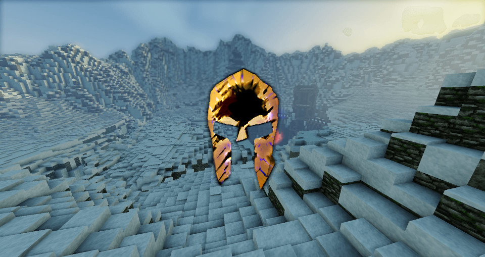

[](https://hydre.io)


[](CONTRIBUTING.md)
[](https://choosealicense.com/licenses/mit/)
[](https://discord.gg/gaqrFT5)

# AresRPG

AresRPG is a non-modded MMORPG Minecraft Server for minecraft 1.16

## Versions

### v1

The version refered as v1 is the first version of AresRPG, developped in 2014 by [@Sceat](https://github.com/Sceat) in Java.

4 classes where available: Barbarian, Archer, Vampire and Mage with skills and competance points

This version works by floor, when you complete a floor you go to the next one.
This version contained a unique floor but a Second floor is build but is missing gameplay and a Third floor is terraformed but is missing buildings

#### Ressources:

[![[AresRpg] GUIDE DU DÉBUTANT | Serveur MMORPG Minecraft](https://img.youtube.com/vi/g4xb67Z5dxY/0.jpg)](https://www.youtube.com/watch?v=g4xb67Z5dxY)

### v2

The V2 is a unreleased version of AresRPG, the goal of this version is to have an procedural open-world instead
of a floor system and more classes than the v1

## Requirements
  - NodeJS >= 14
  - npm

## Install

```bash
$ git clone https://github.com/aresrpg/aresrpg
$ cd aresrpg
$ git submodule update --init
$ npm install
```

## Usage

```bash
$ npm start

# Start with packet logging
$ DEBUG="minecraft-protocol*" npm start
```

## Contributing

See [CONTRIBUTING.md](CONTRIBUTING.md)

## Roadmap
 - Reimplement AresRPG v1:
	- TODO
 - Develop AresRPG v2:
	- TODO

## License
[MIT](https://choosealicense.com/licenses/mit/)
